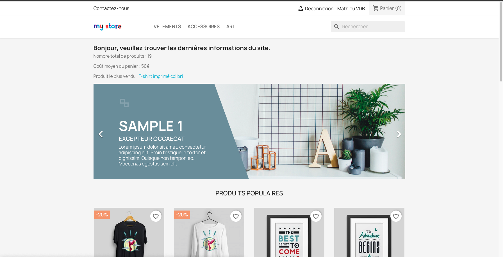
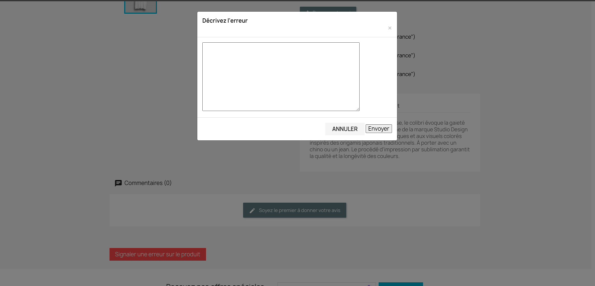
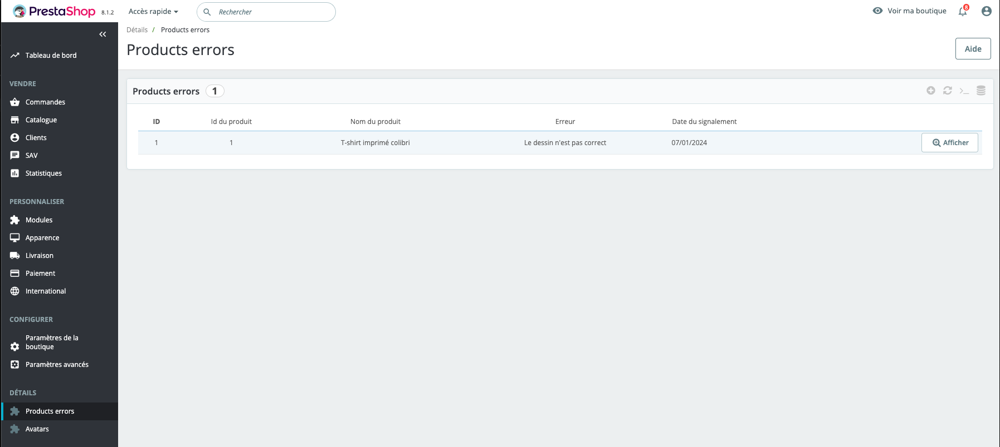

# IT-Room module

###  Informations essentielles du site sur la page d'accueil

- Si l'utilisateur n'est pas connecté en front-office, les informations ne sont pas visibles et un message est affiché invitant l'utilisateur à se connecter
- Si un utilisateur est connecté en front-office, les informations s'affichent en haut de la home page : le nombre total de produits, le coût moyen du panier et le produit le plus vendu
  

### Signalement d'un produit

Les utilisateurs ont la possibilité d'envoyer un signalement d'un produit via sa fiche en front-office.

L'historique des signalements est disponible dans le back-office dans le menu "Product errors"

